# Rancherでの使用方法
Rancherでドライバーを使用するための手順を記載しています。  
事前に[こちらの準備](../setup.md)が終了していることを確認してください。

## ノードドライバーのセットアップ
ノードドライバーをRancherにインストールします。  
RahcnerからTools > Driversを選択します。
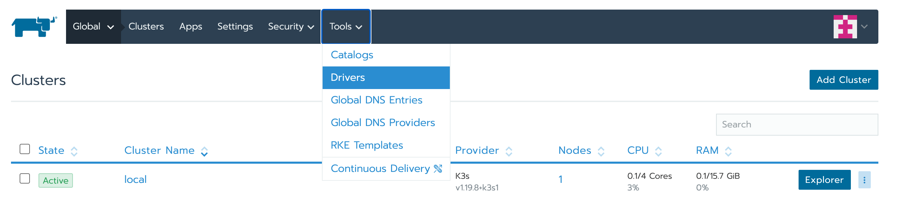

Node DriversタブからAdd Node Driverを選択します。
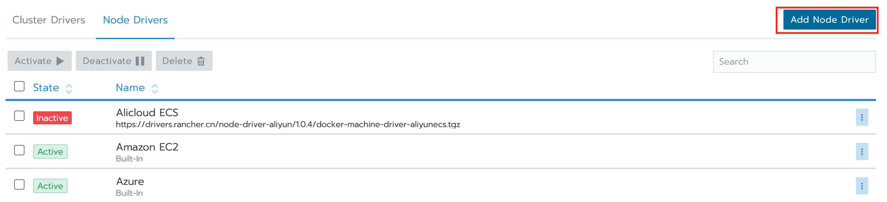

Download URLにGit hub releaseのURLを設定します。または環境内のWebサーバーにドライバーをダウンロードして公開した後、そのURLを設定します。
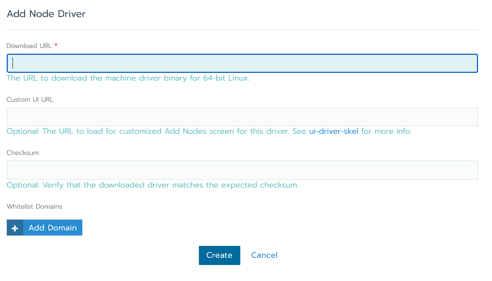

ドライバーのインストールが完了するとドライバーがActiveになります。

## クラスタの作成
Rancher k8sクラスタを作成します。Add Clusterボタンからクラスタ作成メニューに移動します。
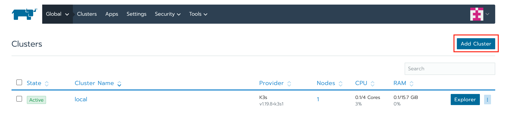

ノードドライバーは先ほど追加した"Ov"を選択します。
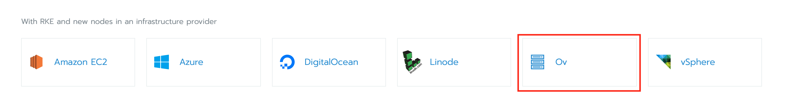

クラスターセットアップのパラメータを入力します。Cluster Name, Name Prefix、役割にチェックした後、ノードドライバー用のパラメータテンプレートを作成します。
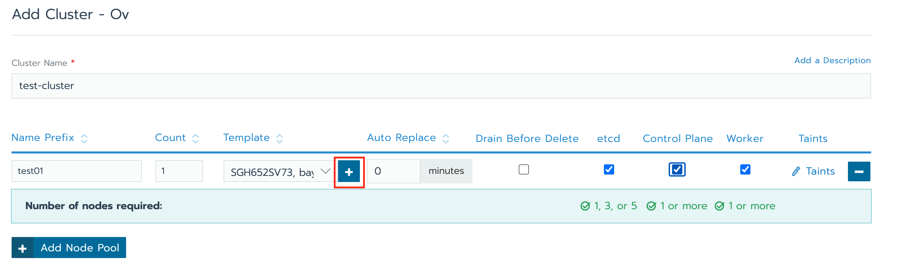

ノードドライバーのパラメータを設定します。
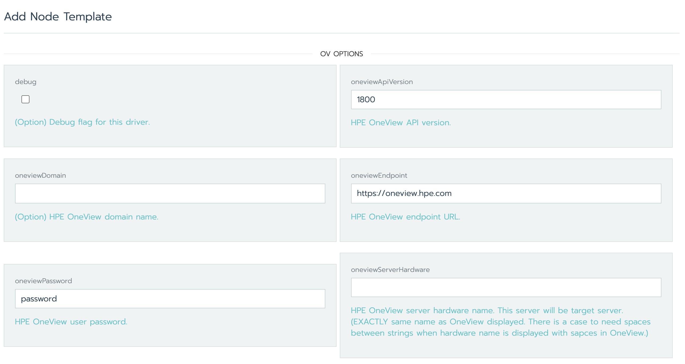

ノードドライバー用のパラメータテンプレート作成後、Rancher k8sの各種設定を選択します。設定後、Createボタンからクラスタを作成します。
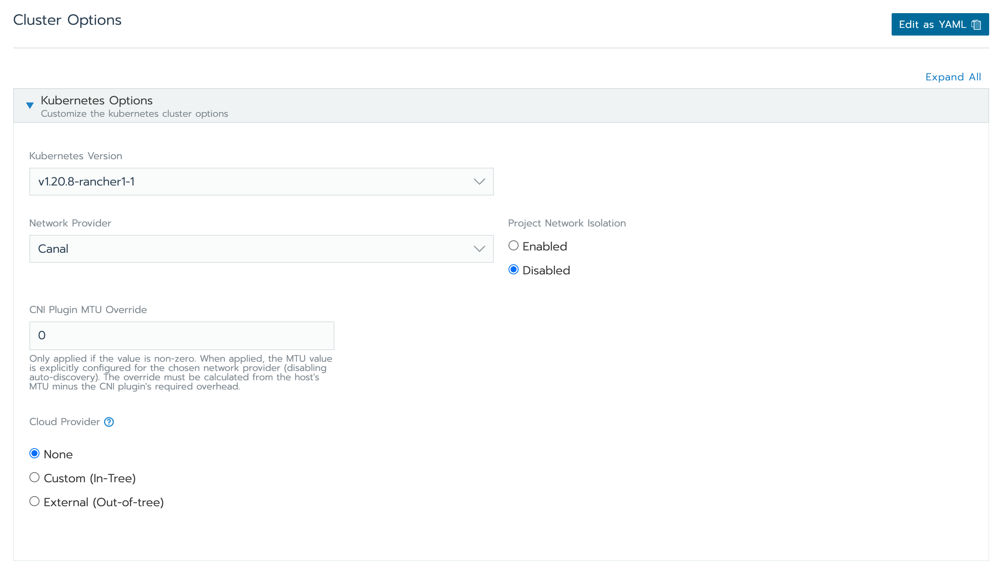

プロビジョニングが開始します。HPE OneViewnでサーバープロファイルの作成が開始されます。
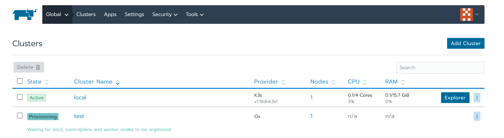

30-40分(環境により異なる)経つとRancher k8sクラスタが完成します。
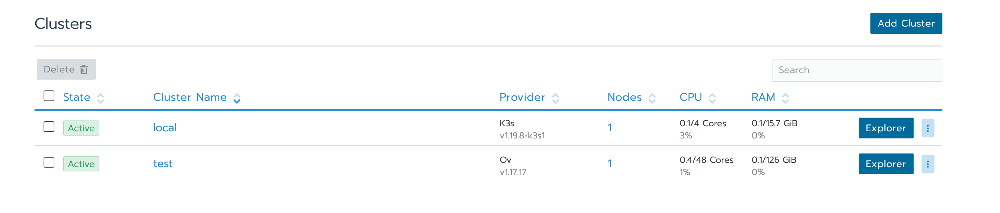

ダッシュボードからクラスタの状態が見えると思います。
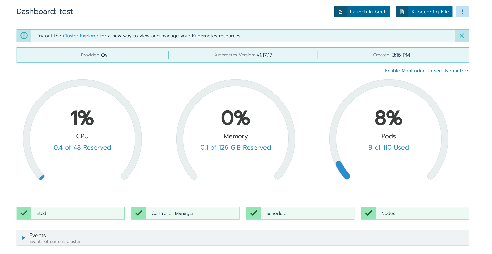